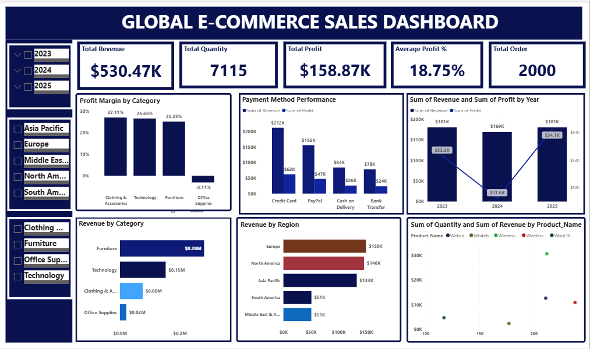

# Global E-Commerce Sales Dashboard
## Project Overview

This Power BI dashboard provides a comprehensive analysis of global e-commerce sales performance. The project examines revenue, profit, product performance, regional sales trends, and customer payment preferences to support data-driven business decisions.
The dashboard was designed to help stakeholders identify top-performing products, evaluate regional performance, understand customer purchasing behavior, and uncover opportunities for business growth.

---

## Business Questions Answered

* Which products generate the highest revenue?
* Which products are sold most frequently?
* How does profit compare across products and regions?
* Which regions contribute the most to overall sales?
* What payment methods do customers prefer?
* Is there a relationship between sales volume and revenue generation?

---

## Tools Used

* Power BI
* Microsoft Excel
* Data Cleaning
* Data Transformation
* Data Visualization
* DAX Measures

---

## Dashboard Features

* Revenue Analysis
* Profit Analysis
* Regional Performance Analysis
* Product Performance Analysis
* Payment Method Analysis
* Interactive Filters and Slicers
* KPI Cards for Key Metrics

---

## Key Insights

* The highest revenue-generating product was not the most frequently sold product, demonstrating the impact of pricing on revenue performance.
* Revenue and profit varied significantly across regions, highlighting differences in market performance.
* Certain products consistently contributed a large share of total revenue.
* Customer purchases were concentrated around a few preferred payment methods.
* Profitability did not always align with sales volume, emphasizing the importance of monitoring both metrics.
* Regional analysis revealed potential opportunities for targeted marketing and business expansion.

---

## Business Recommendations

* Focus marketing efforts on high-profit products to maximize returns.
* Investigate underperforming regions to identify growth opportunities.
* Maintain adequate inventory levels for top-performing products.
* Optimize the checkout experience around customers' preferred payment methods.
* Regularly monitor low-profit products to ensure they contribute positively to overall business performance.

--## Dashboard Preview

### Overview Dashboard

This dashboard provides a high-level view of business performance, including revenue, profit, product performance, regional sales trends, and payment methods.

-

## Dashboard Preview

Insert dashboard screenshots here.

### Overview Dashboard

### Sales Analysis Dashboard

---

## Skills Demonstrated

* Data Cleaning
* Data Analysis
* Dashboard Design
* Business Intelligence
* Data Storytelling
* KPI Development
* Analytical Thinking
* Power BI Visualization

---

## Author

Dorothy Ekenga

Data Analyst | Power BI | Excel | Data Visualization
